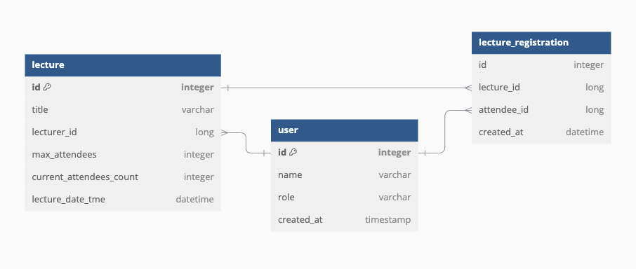

# hhplus-lecture-registration

###프로젝트 개요
특강 신청 서비스는 사용자가 다양한 특강을 신청하고 관리할 수 있는 시스템입니다. 이 서비스는 사용자가 강의를 신청하고, 강좌의 수강 가능 인원 및 신청한 인원을 관리하는 기능을 제공합니다. 또한, 강의를 신청할 수 있는 조건을 체크하고, 동시성 제어를 통해 여러 명의 사용자가 동시에 신청할 때 발생할 수 있는 문제를 해결하는 기능을 제공합니다.

###주요 기능
- 강좌 목록 조회: 수강 가능한 강좌를 조회할 수 있습니다.
- 강의 신청: 사용자가 강의를 신청할 수 있으며, 한 강좌에 대해 중복 신청이 불가능하도록 제어합니다.
- 수강 가능 인원 초과 방지: 강좌의 수강 가능 인원을 초과하는 신청은 처리되지 않도록 제어합니다.
- 동시성 제어: 여러 명의 사용자가 동시에 강의를 신청할 때, 수강 가능 인원을 초과하지 않도록 비관적 락(Pessimistic Lock)을 사용하여 제어합니다.
- 수강 신청 이력 관리: 사용자가 신청한 강의 이력을 저장하고, 중복 신청 시 예외 처리를 수행합니다.

### 비관적 락을 이용한 동시성 제어
이 시스템에서는 강좌 수강 신청 시 **비관적 락(Pessimistic Lock)**을 사용하여, 동시성 문제를 해결하고 있습니다. 예를 들어, 두 명 이상의 사용자가 동일한 강좌에 수강 신청을 동시에 시도하면, 수강 신청 인원이 초과되지 않도록 락을 걸어 신청을 처리합니다.

### ERD
특강 신청 서비스의 데이터베이스 설계에서 주요한 엔티티들은 User, Lecture, LectureRegistration 입니다.   

### * 동시성 제어 및 락 처리
강좌의 수강 인원 수는 동시성 제어가 필요한 데이터입니다. 비관적 락(Pessimistic Lock)을 사용하여 강의 수강 인원이 초과되지 않도록 합니다.    
예를 들어, `current_attendees_count`가 수강 가능 인원(`max_attendees`)을 초과하지 않도록 락을 걸어 처리합니다. 이 구조에서는 락을 걸어 동시 요청이 처리되는 방식을 제어할 수 있습니다.